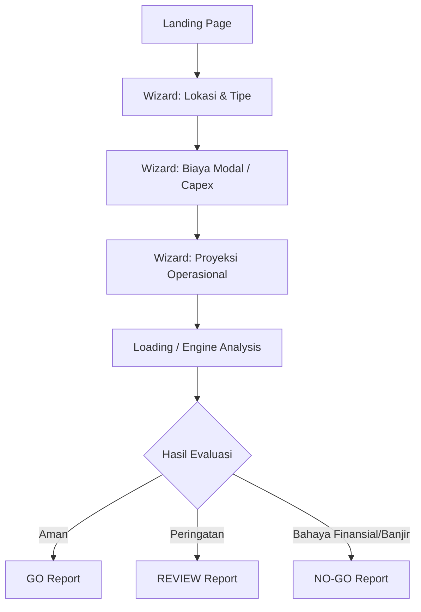

# Wireframe & Mockup Specification v0.1

Wireframe ini dirancang untuk **Low-Fidelity Prototype** yang akan digunakan selama sesi User Discovery (Wawancara). Tujuannya bukan untuk desain akhir, melainkan untuk memvalidasi *kesediaan mengisi data* dan *reaksi terhadap hasil evaluasi*.

## 1. Flow Pengguna (User Journey)

## 2. Definisi Layar (Screen Definitions)

### Screen 1: Landing Page
- **Headline**: "Jangan bayar deposit sebelum yakin. Cek kelayakan lokasi usaha Anda dalam 3 menit."
- **Sub-headline**: "Masukkan data sewa dan lokasi, SiteGuard ID akan menganalisis risiko banjir, persaingan, dan kelayakan finansial."
- **Call-to-Action (CTA)**: [ Cek Lokasi Sekarang ]

### Screen 2: Wizard - Lokasi & Usaha
- **Input 1**: Kategori Usaha (Dropdown: F&B Cafe, F&B Resto, Laundry, Retail).
- **Input 2**: Cari Lokasi (Google Maps autocomplete atau Pin drop).
- **Visual**: Peta interaktif kecil.
- **CTA**: [ Lanjut ke Finansial ]

### Screen 3: Wizard - Biaya Modal (Capex)
- **Input 1**: Harga Sewa per Tahun (Rp).
- **Input 2**: Durasi Sewa (Tahun).
- **Input 3**: Estimasi Renovasi (Rp).
- **Input 4**: Pembelian Alat/Aset (Rp).
- **CTA**: [ Lanjut ke Operasional ]

### Screen 4: Wizard - Proyeksi Operasional
- **Input 1**: Target Omzet per Bulan (Rp).
- **Input 2**: Margin Kotor (%). *(Ada tooltip penjelasan: Pendapatan dikurangi HPP/Bahan Baku)*
- **Input 3**: Biaya Tetap per Bulan (Rp). *(Gaji, Listrik, Air - tidak termasuk sewa)*
- **CTA**: [ Analisis Sekarang ]

### Screen 5: Report Dashboard (The "Aha" Moment)
Layar ini adalah produk inti. Harus jelas, tidak bertele-tele, dan memberi keputusan definitif.

#### Bagian Atas: Keputusan Utama
- **Banner Besar**: Warna Hijau (GO), Kuning (REVIEW), atau Merah (NO-GO).
- **Teks Keputusan**: "NO-GO: Lokasi ini berisiko sangat tinggi untuk modal Anda."
- **Alasan Utama (Knockout Reason)**: "Margin of Safety Anda hanya 5% (Terlalu tipis) dan lokasi berada di Zona Rawan Banjir."

#### Bagian Tengah: Skor 4 Pilar
Grid 2x2 menampilkan ringkasan skor:
1. **Finansial (Merah - 30/100)**: "Payback period melebihi durasi kontrak sewa."
2. **Pasar & Kompetisi (Kuning - 60/100)**: "Ada 12 kompetitor dalam radius 2 km."
3. **Risiko Bencana (Merah - 10/100)**: "Titik lokasi berada di indeks banjir 0.75 (Tinggi) menurut InaRISK."
4. **Regulasi (Abu-abu)**: "Cek mandiri RDTR dan KBLI." (Menyediakan link ke OSS).

#### Bagian Bawah: Rekomendasi Tindakan
- [ ] Negosiasi harga sewa turun minimal 20%.
- [ ] Cari ruko dengan posisi lebih tinggi dari jalan (elevasi naik).
- [ ] Unduh Laporan PDF (Premium).

## 3. Strategi Pengujian saat Interview
Saat mewawancarai pemilik UMKM, kita akan:
1. Menunjukkan Screen 1-4 dan menanyakan: *"Apakah Anda tahu angka-angka ini saat mau buka cabang? Apakah Anda malas mengisinya?"*
2. Menunjukkan Screen 5 varian **NO-GO**, lalu bertanya: *"Jika Anda sudah naksir berat dengan ruko ini, lalu sistem kami bilang NO-GO dan membeberkan risiko ini, apa yang akan Anda lakukan? Berhenti atau tetap lanjut?"*
