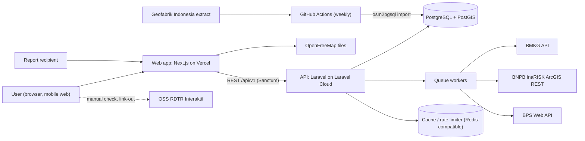
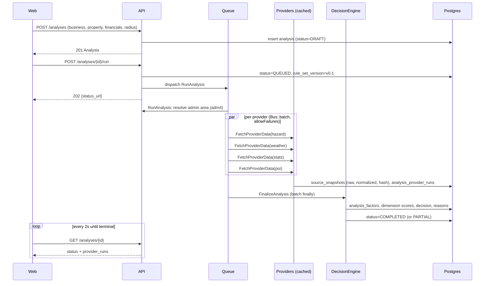

# Functional Specification Document (FSD) v0.1 (outline)

| Item | Value |
|------|-------|
| Status | Outline. Sections marked **TBD** are filled after spikes A-T01 to A-T05 |
| Related | [PRD](../03-product/prd.md), [ERD](../05-database/erd.md), [OpenAPI](../06-api/openapi.yaml), [Data Source Catalog](../00-research/data-source-catalog.md), [ADR log](../decisions/adr-log.md) |

## 01. System Context



OSM data is never fetched at request time. It is imported weekly into PostGIS (ADR-003). OSS is a link-out; the system does not call it (ADR-004).

## 02. Component Architecture

### 2.1 Web (`apps/web`, Next.js App Router)

| Module | Responsibility |
|--------|----------------|
| `app/(marketing)` | Landing, sample report |
| `app/(app)/analyses/new` | Wizard steps 02 to 04 |
| `app/(app)/analyses/[id]` | Processing (05) and Decision dashboard (06) with evidence drawer |
| `app/(app)/compare` | Compare (07) |
| `app/(app)/reports/[id]`, `app/r/[token]` | Report preview (08), public shared view |
| `lib/api` | Generated client from `openapi.yaml` (e.g. `openapi-typescript` + `openapi-fetch`) |
| `lib/finance` | **None.** Finance preview calls the API so formulas exist in one place (`POST /finance/preview`) |
| `components/map` | MapLibre GL JS, OpenFreeMap style, radius circle, POI layers from API GeoJSON |

### 2.2 API (`apps/api`, Laravel)

```
app/
├── Domain/
│   ├── Analysis/      Analysis aggregate, status machine, AnalysisOrchestrator
│   ├── Finance/       FinanceCalculator (pure), SensitivityRunner
│   ├── Location/      LocationEngine (PostGIS queries)
│   ├── Hazard/        HazardEngine, HazardClassifier
│   ├── Market/        MarketEngine
│   ├── Regulation/    ChecklistBuilder, RegulatoryStatusResolver
│   ├── Decision/      DecisionEngine, RuleSet (versioned), FactorScorer
│   └── Shared/        FactorResult, FactorStatus enum, Money, Percent
├── Providers/         (data adapters, not Laravel service providers)
│   ├── Contracts/     HazardProvider, WeatherProvider, StatsProvider, PoiProvider, AdminAreaProvider, RegulatoryProvider
│   ├── Bnpb/          InaRiskHazardProvider, InaRiskAdminAreaProvider
│   ├── Bmkg/          BmkgWeatherProvider
│   ├── Bps/           BpsStatsProvider
│   ├── Osm/           PostgisPoiProvider
│   ├── Regulatory/    ChecklistOnlyRegulatoryProvider
│   ├── Caching/       SnapshotCachingDecorator (wraps any provider)
│   └── Fake/          Fake*Provider for tests and prototype
├── Jobs/              RunAnalysis, FetchProviderData, FinalizeAnalysis, GenerateReport
├── Http/              Controllers (thin), FormRequests, Resources
├── Models/            Eloquent models
└── Policies/          AnalysisPolicy, PropertyPolicy, ReportPolicy
```

Rule: controllers call application services; domain classes never call HTTP clients directly; providers never compute scores.

## 03. Sequence: run analysis



Status machine: `DRAFT → QUEUED → RUNNING → COMPLETED | COMPLETED_PARTIAL | FAILED`. `COMPLETED_PARTIAL` means at least one provider failed; the decision is still produced with UNKNOWN factors. `FAILED` only for internal errors or timeout (> 120 s).

Finance and regulatory inputs can change after completion (e.g. user verifies zoning). That triggers `POST /analyses/{id}/recalculate`, which re-runs only Finance + Decision against existing snapshots (no external calls) and creates a new `analysis_results` version.

## 04. Domain Model

### 4.1 Core types

```php
enum FactorStatus: string { case OK = 'OK'; case STALE = 'STALE'; case UNKNOWN = 'UNKNOWN'; }
enum HazardClass: string { case LOW = 'LOW'; case MEDIUM = 'MEDIUM'; case HIGH = 'HIGH'; case UNKNOWN = 'UNKNOWN'; }
enum Decision: string { case GO = 'GO'; case REVIEW = 'REVIEW'; case NO_GO = 'NO_GO'; }
enum Confidence: string { case HIGH = 'HIGH'; case MEDIUM = 'MEDIUM'; case LOW = 'LOW'; }
enum RegulatoryStatus: string { case NOT_VERIFIED = 'NOT_VERIFIED'; case USER_VERIFIED = 'USER_VERIFIED'; case CONFLICT = 'CONFLICT'; }

final class FactorResult {
    public function __construct(
        public string $dimension,      // financial|market|risk|operational|regulatory
        public string $key,            // e.g. hazard.flood_index
        public FactorStatus $status,
        public mixed $rawValue,        // null when UNKNOWN
        public ?string $unit,
        public ?string $class,         // LOW/MEDIUM/HIGH for hazards
        public ?float $score,          // 0..100, null when UNKNOWN or not scored
        public float $weight,          // within dimension; 0 = display only
        public bool $critical,         // UNKNOWN triggers V7
        public ?string $unknownReason, // PROVIDER_ERROR|TIMEOUT|NO_COVERAGE|EXPIRED|NOT_APPLICABLE
        public ?int $snapshotId,
        public string $method,         // human-readable method description
    ) {}
}
```

### 4.2 Provider contracts

```php
interface HazardProvider {
    /** @return list<FactorResult> one per hazard type, UNKNOWN on failure, never throws for data errors */
    public function assess(Point $point, int $radiusM): ProviderOutcome;
}
interface WeatherProvider   { public function forecast(AdminArea $area): ProviderOutcome; }
interface StatsProvider     { public function regional(AdminArea $area): ProviderOutcome; }
interface PoiProvider       { public function around(Point $point, int $radiusM, BusinessType $type): ProviderOutcome; }
interface AdminAreaProvider { public function resolve(Point $point): ?AdminArea; }
interface RegulatoryProvider{ public function checklist(BusinessType $type, Point $point): Checklist; }
```

`ProviderOutcome` carries `status` (OK, FAILED, PARTIAL), `factors`, `snapshotIds`, `error`. Providers translate failures into UNKNOWN factors; they never return defaults like 0 or LOW.

### 4.3 Factor scoring (rule set v0.1)

Piecewise-linear functions; thresholds are config in `config/ruleset/v0_1.php`, not code.

| Dimension | Factor | Score mapping | Weight | Critical |
|-----------|--------|---------------|--------|----------|
| Financial | Reserve months | gap < 0 → 0; 0 → 30; 3 → 70; ≥ 6 → 100 | 30 | yes |
| Financial | Margin of safety | < 0 → 0; 10% → 30; 25% → 70; ≥ 40% → 100 | 30 | yes |
| Financial | Rent-to-revenue | ≤ 10% → 100; 15% → 75; 25% → 30; ≥ 35% → 0 | 20 | yes |
| Financial | Payback / lease term | ≤ 0.5 → 100; 1.0 → 50; ≥ 1.5 or null → 0 | 20 | yes |
| Market | Population in radius | percentile vs MVP-region reference grid | 35 | no |
| Market | Demand-POI density (education, office, residential proxy) | percentile vs reference grid | 35 | no |
| Market | Competitor density | inverted percentile, floor 20 (some competition signals demand) | 30 | no |
| Market | BPS kab/kota indicators | display only | 0 | no |
| Risk | Flood, flash flood, landslide, liquefaction, earthquake, extreme weather | LOW 100, MEDIUM 60, HIGH 20 | see below | flood = yes |
| Operational | Distance to primary/secondary road | ≤ 100 m → 100; 500 m → 50; ≥ 1500 m → 10 | 60 | no |
| Operational | Transit POIs in radius | percentile vs reference grid | 40 | no |
| Operational | BMKG 72 h forecast | display only (a 3-day forecast must not move a multi-year lease score) | 0 | no |

Risk dimension score = `0.5 * min(hazard scores) + 0.5 * mean(hazard scores)` so the worst hazard dominates.

Reference grid: a precomputed 1 km grid over the MVP region with POI counts and population per cell, refreshed after each OSM import. Percentiles make every market score explainable ("education POI density at the 78th percentile of Jabodetabek").

Dimension score is `null` when available factor weight < 50% of the dimension total. Confidence: HIGH when no critical factor is UNKNOWN, coverage ≥ 80%, nothing STALE; MEDIUM when coverage ≥ 60%; otherwise LOW.

Hazard index classification thresholds: **TBD (A-T01)**. Working assumption: BNPB index 0 to 1 with class breaks at 0.333 and 0.666. Must be confirmed against BNPB documentation before use.

### 4.4 Decision

Implements PRD §7.2 exactly (K1 to K4, V1 to V7, weighted threshold 65). Output for the PRD §9 laundry example. The financial score (35) follows from the §4.3 mapping: reserve 0 × 30, MoS 21% → 59.3 × 30, rent-to-revenue 15.7% → 71.9 × 20, payback ratio 1.375 → 12.5 × 20. Market, risk, and operational values are illustrative until real data is fetched.

```json
{
  "decision": "NO_GO",
  "confidence": "MEDIUM",
  "rule_set_version": "v0.1",
  "triggered_rules": ["K1", "V2", "V3", "V6"],
  "dimension_scores": { "financial": 35, "market": 74, "risk": 68, "operational": 81 },
  "regulatory_status": "NOT_VERIFIED",
  "weighted_score": 60.2,
  "reasons": [
    { "rule": "K1", "severity": "KNOCKOUT", "factor_key": "finance.capital_gap", "message_id": "reason.k1", "params": { "shortfall": 55000000 } }
  ]
}
```

`message_id` + `params` keeps copy translatable and testable; the web renders the text.

## 05. API Contract

Contract-first: [openapi.yaml](../06-api/openapi.yaml) is the source of truth. CI fails if Laravel responses drift (contract tests with `spectator` or schema validation in feature tests) or if the generated TS client is out of date.

## 06. Database Design

See [erd.md](../05-database/erd.md). Key points: `geography(Point, 4326)` with GIST indexes; generic `source_snapshots` table (ADR-006); results versioned per run/recalculation.

## 07. External Integration

| Provider | Call pattern | Timeout | Retries | Concurrency guard |
|----------|-------------|---------|---------|-------------------|
| BMKG | `GET /publik/prakiraan-cuaca?adm4=` | 8 s | 2, exponential backoff | Global limiter 50/min (margin under 60/min/IP) |
| InaRISK | `ImageServer/identify` per hazard layer (6 calls) | 10 s each | 2 | 5 concurrent |
| InaRISK admin | `batas_administrasi/MapServer/{layer}/query` point-in-polygon | 8 s | 2 | shared with above |
| BPS | Dynamic data endpoints per indicator | 10 s | 2 | key-level limit **TBD** |
| OSM | Local PostGIS (`ST_DWithin` on `geography`) | 2 s statement timeout | 0 | n/a |

Every external call: build request key → check cache (snapshot within TTL) → fetch → validate schema → store raw + normalized + `sha256(raw)` → write `source_fetch_logs` → return normalized.

Outbound IP note: BMKG limits per IP. If Laravel Cloud egress IPs are shared across tenants, other tenants may consume the quota. **TBD**: confirm egress model; if shared, cache BMKG by `adm4` aggressively and accept UNKNOWN on 429.

## 08. Caching

- Snapshot-as-cache: `source_snapshots` with `expires_at` is the durable cache; Redis holds hot keys only.
- Cache key: `provider:dataset:normalized_request` (e.g. `bmkg:forecast:36.74.05.1001`, `inarisk:flood:-6.29557,106.74663` with coordinates rounded to 5 decimals, about 1 m).
- TTL table: Data Source Catalog §3.
- Hazard and stats are spatially stable; nearby properties reuse snapshots.

## 09. Queue

| Queue | Jobs | Workers |
|-------|------|---------|
| `analysis` | RunAnalysis, FinalizeAnalysis | 2 |
| `providers` | FetchProviderData | 4 |
| `reports` | GenerateReport | 1 |

- `Bus::batch()->allowFailures()` per analysis, `finally` dispatches FinalizeAnalysis.
- Job idempotency: unique by `analysis_id + provider`.
- Watchdog (scheduler, every minute): analyses `RUNNING` > 120 s → finalize with available data or mark `FAILED`.

## 10. Error Handling

| Class | Example | Handling | User sees |
|-------|---------|----------|-----------|
| Provider transient | timeout, 5xx, 429 | retry with backoff, then UNKNOWN | "Data X tidak tersedia saat ini" |
| Provider contract | unexpected JSON shape | no retry, UNKNOWN, alert | same |
| No coverage | point outside raster / admin area not found | UNKNOWN (`NO_COVERAGE`) | "Tidak ada data untuk titik ini" |
| Validation | out-of-region point, GM > 1 | 422 with field errors | inline errors |
| Authorization | other user's analysis | 404 (not 403, to avoid ID probing) | not found |
| Internal | bug | 500, Sentry/Nightwatch, analysis FAILED | retry option |

Invariant tested in CI: **no code path converts a provider failure into a non-UNKNOWN factor.** (PRD AC-US12)

## 11. Security

Detailed threat model is a separate document (planned). Baseline:

- Auth: Laravel Sanctum SPA cookie auth. Requires web and API on the same registrable domain (e.g. `app.siteguard.id` and `api.siteguard.id`) for SameSite cookies. Vercel preview URLs (`*.vercel.app`) cannot share cookies with the API; previews use a staging API domain plus token auth, **TBD** in Sprint 0.
- Authorization: Policies on every resource; IDs are ULIDs.
- Share links: 32-byte random token, stored as SHA-256 hash, expiry default 14 days, revocable.
- Rate limits: per user (analyses per day), per IP on auth and finance preview.
- Input: coordinates validated against MVP region polygon; all numeric inputs bounded.
- Secrets: BPS key server-side only.
- Privacy (UU 27/2022): financial inputs are tied to the user; deletion cascades; aggregated, de-identified use for calibration only with explicit consent flag.
- Liability: disclaimer on dashboard and report; ToS states decision-support nature.

## 12. Observability

- Errors: Sentry (web), Laravel Nightwatch or Sentry (API).
- Provider health from `source_fetch_logs`: success rate, p95 latency, cache hit ratio, last success per provider. Exposed at `GET /data-sources` (public summary) and an internal admin page.
- Business metrics: PRD §10 events to product analytics (PostHog or similar, EU/ID data residency **TBD**).

## 13. Logging

- Structured JSON logs with `analysis_id`, `provider`, `request_key`, `duration_ms`, `cache_hit`.
- Never log financial inputs or share tokens.
- Raw provider payloads live in `source_snapshots`, not logs.

## 14. Performance

| Target | Approach |
|--------|----------|
| Finance preview < 300 ms | Pure PHP calculator, no DB writes; web debounces 300 ms |
| POI queries < 200 ms | GIST on `geography`, filter by category first, `ST_DWithin` |
| Analysis < 60 s cold | Parallel provider jobs, per-call timeouts, watchdog |
| Analysis < 10 s warm | Snapshot reuse by rounded coordinates and `adm4` |

## 15. Deployment

| Component | Platform | Environments |
|-----------|----------|--------------|
| `apps/web` | Vercel | Preview per PR, `staging` (develop), `production` (main) |
| `apps/api` + queue + scheduler | Laravel Cloud | Preview per PR (if PostGIS spike passes on preview DBs), staging, production |
| PostgreSQL + PostGIS | Laravel Cloud Serverless Postgres (A-T03) | per environment |
| OSM import | GitHub Actions scheduled weekly: download extract, `osmium extract` Jabodetabek bbox, `osm2pgsql` into staging then production, rebuild reference grid | |

Branching follows the proposal (`main`, `develop`, `feature/*`, `fix/*`, `research/*`). For a one or two person team, trunk-based (`main` + short-lived branches + previews) would remove a merge step; revisit after S1.

CI (GitHub Actions) per PR: lint, PHPUnit/Pest (unit + feature + contract), Vitest, Playwright smoke against preview, OpenAPI lint (`redocly lint`), generated-client drift check.

## Open questions

| ID | Question | Owner | Blocking |
|----|----------|-------|----------|
| OQ-1 | PDF generation: headless Chromium on Laravel Cloud is uncertain. Options: Gotenberg service, Vercel function with Chromium, or print-optimized HTML first | Tech | S5 |
| OQ-2 | Sanctum cookie auth with Vercel previews | Tech | S1 |
| OQ-3 | InaRISK class thresholds and commercial terms | Product + BNPB | S3 |
| OQ-4 | Laravel Cloud egress IP model for BMKG limit | Tech | S3 |
